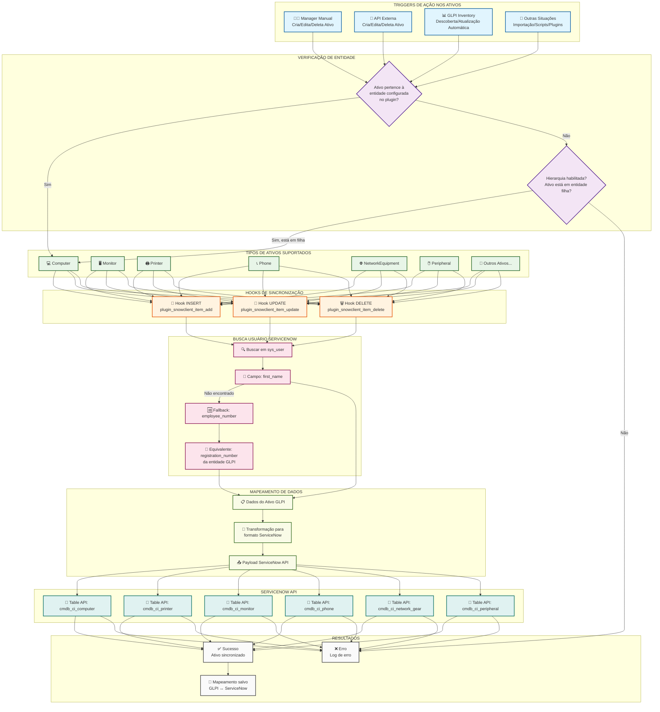

## Fluxo de Sincronização Unilateral de Ativos - ServiceNow Client Plugin

### Cenários de Trigger:

1. **🧑‍💼 Manager Manual**: Administrador/técnico cria, edita ou deleta ativos via interface GLPI
2. **🔌 API Externa**: Sistemas externos fazem operações via API REST do GLPI
3. **📊 GLPI Inventory**: Agent de inventário descobre ou atualiza ativos automaticamente
4. **🔧 Outras Situações**: Importações em lote, scripts personalizados, outros plugins

### Verificações de Entidade:

- ✅ Verifica se o ativo pertence à entidade configurada no plugin
- ✅ Se hierarquia estiver habilitada, inclui entidades filhas
- ❌ Ativos fora do escopo são ignorados

### Tipos de Ativos Suportados:

- **Computer** → `cmdb_ci_computer`
- **Monitor** → `cmdb_ci_monitor` 
- **Printer** → `cmdb_ci_printer`
- **Phone** → `cmdb_ci_phone`
- **NetworkEquipment** → `cmdb_ci_network_gear`
- **Peripheral** → `cmdb_ci_peripheral`

### Mapeamento de Usuário:

1. **Busca em `sys_user`** no ServiceNow
2. **Prioridade**: `first_name` (campo principal)
3. **Fallback**: `employee_number` 
4. **Equivalência**: `registration_number` da entidade GLPI

### Hooks de Sincronização:

- **INSERT**: Novos ativos são criados no ServiceNow
- **UPDATE**: Alterações são sincronizadas
- **DELETE**: Remoções são replicadas

Este fluxo garante sincronização unilateral (GLPI → ServiceNow) respeitando as regras de entidade e hierarquia configuradas no plugin.
