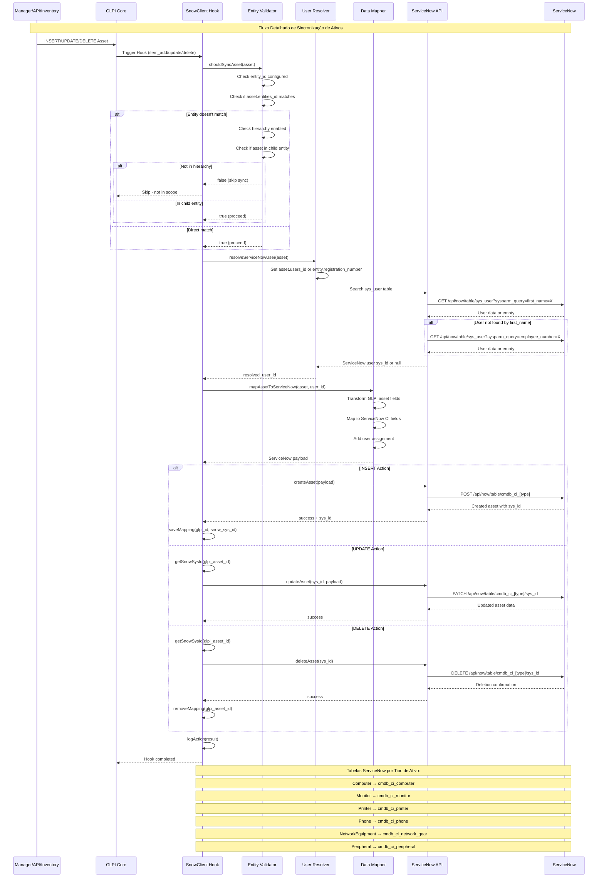

## Detalhes Técnicos da Implementação

### 1. Hooks Necessários no setup.php

```php
// Adicionar aos hooks existentes
$PLUGIN_HOOKS['item_add']['snowclient'] = [
    'Computer' => 'plugin_snowclient_item_add',
    'Monitor' => 'plugin_snowclient_item_add', 
    'Printer' => 'plugin_snowclient_item_add',
    'Phone' => 'plugin_snowclient_item_add',
    'NetworkEquipment' => 'plugin_snowclient_item_add',
    'Peripheral' => 'plugin_snowclient_item_add',
    // Manter hooks existentes de Ticket...
];

$PLUGIN_HOOKS['item_update']['snowclient'] = [
    'Computer' => 'plugin_snowclient_item_update',
    'Monitor' => 'plugin_snowclient_item_update',
    'Printer' => 'plugin_snowclient_item_update', 
    'Phone' => 'plugin_snowclient_item_update',
    'NetworkEquipment' => 'plugin_snowclient_item_update',
    'Peripheral' => 'plugin_snowclient_item_update',
    // Manter hooks existentes de Ticket...
];

$PLUGIN_HOOKS['item_delete']['snowclient'] = [
    'Computer' => 'plugin_snowclient_item_delete',
    'Monitor' => 'plugin_snowclient_item_delete',
    'Printer' => 'plugin_snowclient_item_delete',
    'Phone' => 'plugin_snowclient_item_delete', 
    'NetworkEquipment' => 'plugin_snowclient_item_delete',
    'Peripheral' => 'plugin_snowclient_item_delete',
    // Manter hooks existentes de Ticket...
];
```

### 2. Tabela de Mapeamento de Ativos

```sql
CREATE TABLE `glpi_plugin_snowclient_asset_mappings` (
  `id` int unsigned NOT NULL auto_increment,
  `glpi_asset_id` int NOT NULL,
  `glpi_asset_type` varchar(100) NOT NULL,
  `snow_sys_id` varchar(32) NOT NULL,
  `snow_table` varchar(100) NOT NULL,
  `date_creation` timestamp NULL DEFAULT NULL,
  `date_mod` timestamp NULL DEFAULT NULL,
  PRIMARY KEY (`id`),
  UNIQUE KEY `unique_glpi_asset` (`glpi_asset_id`, `glpi_asset_type`),
  KEY `snow_sys_id` (`snow_sys_id`)
);
```

### 3. Mapeamento de Tipos para Tabelas ServiceNow

| GLPI Type | ServiceNow Table | ServiceNow Class |
|-----------|------------------|------------------|
| Computer | cmdb_ci_computer | Computer |
| Monitor | cmdb_ci_monitor | Monitor |
| Printer | cmdb_ci_printer | Printer |
| Phone | cmdb_ci_phone | Phone |
| NetworkEquipment | cmdb_ci_network_gear | Network Gear |
| Peripheral | cmdb_ci_peripheral | Peripheral |

### 4. Campos de Mapeamento Básico

**Computer (cmdb_ci_computer):**
- `name` ← `Computer.name`
- `serial_number` ← `Computer.serial`
- `model` ← `ComputerModel.name`
- `manufacturer` ← `Manufacturer.name`
- `assigned_to` ← resolved user sys_id
- `location` ← `Location.name`
- `install_status` ← mapped from state

**Monitor (cmdb_ci_monitor):**
- `name` ← `Monitor.name`
- `serial_number` ← `Monitor.serial`
- `model` ← `MonitorModel.name`
- `manufacturer` ← `Manufacturer.name`
- `size` ← `Monitor.size`

**Printer (cmdb_ci_printer):**
- `name` ← `Printer.name`
- `serial_number` ← `Printer.serial`
- `model` ← `PrinterModel.name`
- `manufacturer` ← `Manufacturer.name`

### 5. Configurações Adicionais Necessárias

No formulário de configuração adicionar:

- ✅ **Sync Assets**: Habilitar sincronização de ativos
- ✅ **Asset Types**: Quais tipos sincronizar (multi-select)
- ✅ **User Resolution Strategy**: first_name vs employee_number priority
- ✅ **Default Assignment**: Usuário padrão quando não encontrar

### 6. Logs e Debug

- Log detalhado de cada operação de ativo
- Controle de rate limiting para APIs
- Retry automático em caso de falha temporária
- Dashboard de estatísticas de sincronização
